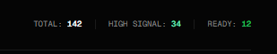
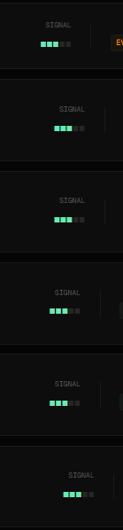
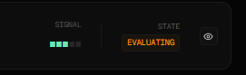
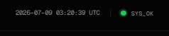

# UX Notes

## 🔴 Bugs

- [ ] Search doesn't work yet.
- [ ] Filter button doesn't work.
- [ ] when i click any card it doesn't open. need to debug it.
- [ ]

---

## 🟡 High Priority

- [ ] Edit Idea
- [ ] Delete Idea
- [ ] Search
- [ ] Filters
- [ ] there is only three categories (twitter, youtube and newsletter) i want to have every other category as well where i can just type or select the category that i want and it shows up.

---

## 🔵 UX Improvements

- [ ] Auto-focus Title field
- [ ] Ctrl + Enter to save
- [ ] Close modal after save animation
- [ ] Better success message
 This feature is uselss and it doesn't mean anything yet. We should remove it or make it useful.
 This signal feature is also useless and it should signal priority but it doesn't work.
 And idk what this EYE means? and it doesn't work also.
 The time is in UTC but i follow IST so make it IST.

---

## 🟣 Visual Improvements

- [ ] Status colors
- [ ] Better empty state
- [ ] Card hover feels weak

---

## 🟢 Future Ideas

- [ ] AI score
- [ ] Duplicate idea
- [ ] Archive
- [ ] Favorite
- [ ] Convert to Pipeline